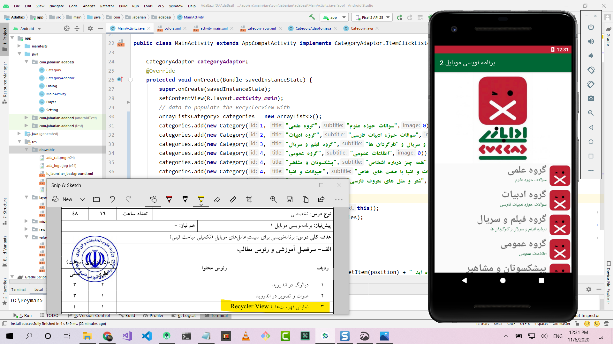

Start with an empty activity. You will perform the following tasks to add the RecyclerView. All you need to do is copy and paste the code in each section. Later you can customize it to fit your needs.

1. Add dependencies to gradle
2. Add the xml layout files for the activity and for the RecyclerView row
3. Make the RecyclerView adapter
4. Initialize the RecyclerView in your activity

Update Gradle dependencies
--------------------------
In the `gradle.build` (module)
```java
    implementation 'com.android.support:appcompat-v7:29.0.0'
    implementation 'com.android.support:recyclerview-v7:29.0.0'
```


Create row layout
-----------------
`recyclerview_row.xml`   

Create the adapter
------------------
`MyRecyclerViewAdapter.java`   

Initialize RecyclerView in Activity
-------------------------------------
```java
    protected void onCreate(Bundle savedInstanceState) {
        super.onCreate(savedInstanceState);
        setContentView(R.layout.activity_main);
        // data to populate the RecyclerView with
        ArrayList<Category> categories = new ArrayList<>();
        categories.add(new Category(1, "گروه علمی","سوالات حوزه علوم",0));
        categories.add(new Category(2, "گروه ادبیات","سوالات حوزه ادبیات فارسی",0));
        categories.add(new Category(3, "گروه فیلم و سریال","درباره فیلم و سریال و کارگردان ها",0));
        categories.add(new Category(4, "گروه عمومی","اطلاعات عمومی",0));
        categories.add(new Category(5, "پیشکسوتان و مشاهیر","همه چیز درباره اشخاص",0));
        categories.add(new Category(6, "حیوانات و اشیا","حیوانات و اشیا با صفت های خاص",0));
        categories.add(new Category(7, "ضرب المثل","شعر و مثل های معروف فارسی",0));
        // set up the RecyclerView
        RecyclerView recyclerView = findViewById(R.id.rycCategory);
        recyclerView.setLayoutManager(new LinearLayoutManager(this));
        categoryAdaptor = new CategoryAdaptor(this, categories);
        categoryAdaptor.setClickListener(this);
        recyclerView.setAdapter(categoryAdaptor);
    }
```




