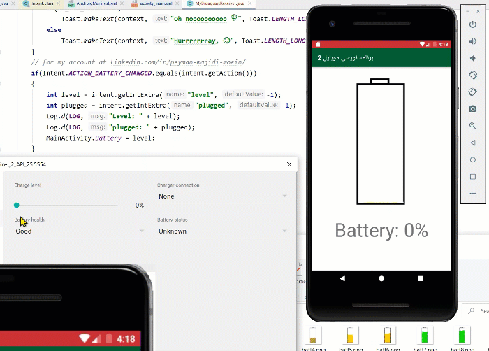

# BroadcastReceiver

1. Define a java class extends from BroadcastReceiver
2. add some lines to AndroidManifest.xml   
after `</activity>`, before `</application>`
-->
```xml
 <receiver android:name=".MyBoadcastReciever">
            <intent-filter>
                <action android:name="android.intent.action.BATTERY_CHANGED" />
            </intent-filter>
</receiver>
```
3. register broadcast in MainActivity.java

