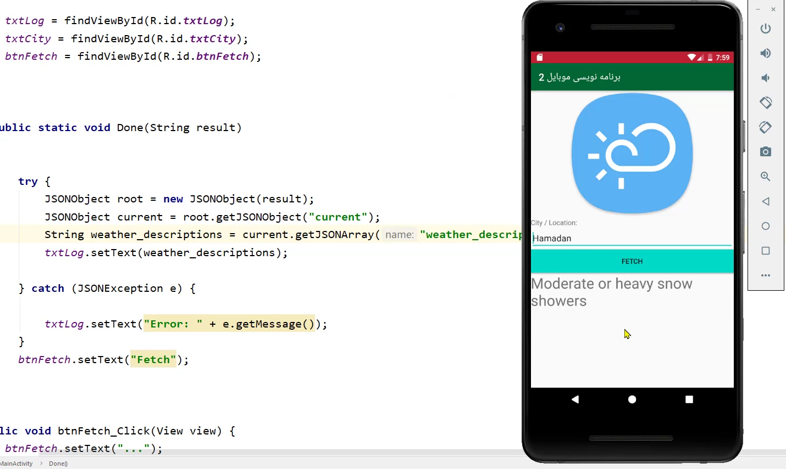

# Follow these steps

1. Add this line to `AndroidManifest.xml`
```xml
   <uses-permission android:name="android.permission.INTERNET"/>
```

2. Make a new class and extends from AsyncTask
```java
public class Weather extends AsyncTask<String, String, String> 
```
doInBackground method:
```java
@Override
    protected String doInBackground(String... params) {

        String address = params[0];

        HttpURLConnection connection = null;
        BufferedReader reader = null;


        try {
            URL url = new URL(address);
            connection = (HttpURLConnection) url.openConnection();
            connection.connect();


            InputStream stream = connection.getInputStream();

            reader = new BufferedReader(new InputStreamReader(stream));

            StringBuffer buffer = new StringBuffer();
            String line = "";

            while ((line = reader.readLine()) != null) {
                buffer.append(line + "\n");
                Log.d(TAG, "> " + line);

            }

            return  buffer.toString();

        } catch (MalformedURLException e) {
            e.printStackTrace();
        } catch (IOException e) {
            e.printStackTrace();
        }

        return null;
    }
    ```

3. Parse JSON Like this
```java
          try {
              JSONObject root = new JSONObject(result);
              JSONObject current = root.getJSONObject("current");
              String weather_descriptions = current.getJSONArray("weather_descriptions").getString(0);
              txtLog.setText(weather_descriptions);

          } catch (JSONException e) {

              txtLog.setText("Error: " + e.getMessage());
          }
```

4. Use the class
```java
        String city = txtCity.getText().toString();
        new Weather().execute("http://api.weatherstack.com/current?access_key="+ Setting.API_KEY_weatherstack+"&query=" + city);
```




Get the api key from here:   
https://weatherstack.com/


Link to aparat video:  
https://aparat.com/v/Tf39Z